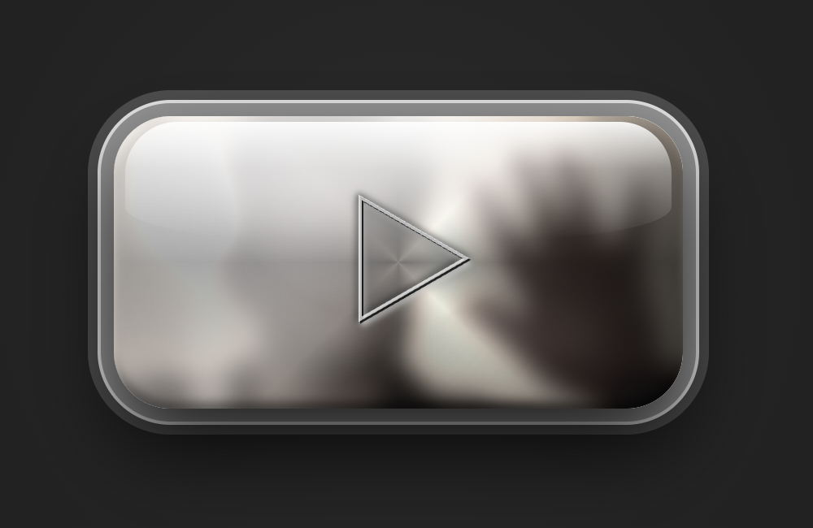

# Reflective Steel Button 💎

A hyper-realistic, metallic play button designed with vanilla web technologies. It features dynamic, real-time reflections of the user's environment by processing the webcam feed through advanced CSS blend modes and filters on a polished stainless steel surface.

 *(Note: Image captured from running demo)*

## ✨ Features
- **Ultra-Realistic Metal:** Custom multi-layered gradients and box-shadows simulating polished/brushed steel.
- **Dynamic Reflections:** Real-time webcam integration mapped directly onto the button surface.
- **Embedded SVG Icon:** A reflective play icon deeply carved into the metal with 3D inset borders.
- **Glassy Highlight:** A screen-blended highlight mimicking studio light catching a curved edge.
- **Interactive:** Hover and active states with tactile feedback.

## 🚀 Getting Started

### Prerequisites
- Node.js (for the test server)
- A webcam (for the reflection effect)

### Running Locally
1. **Clone the repository**:
   ```bash
   git clone https://github.com/Narendra-Kamath/reflective-steel-button.git
   cd reflective-steel-button
   ```
2. **Start the server**:
   ```bash
   npm start
   ```

   Or for development (with auto-restart):
   ```bash
   npm run dev
   ```

3. **Open the Application**:
   Navigate to `http://localhost:3000` in your web browser.

## Features

- **Dynamic Reflections**: Uses `getUserMedia` to project a blurred, desaturated camera feed onto the button surface.
- **Advanced CSS**: Utilizes multiple gradients, `mix-blend-mode`, and `backdrop-filter` for a premium metallic look.
- **Responsive Interaction**: Smooth transitions and tactile active states.
- **HTML5** (Structure)
- **CSS3** (Complex Gradients, Mix-Blend-Modes, Filters)
- **SVG** (Embedded Iconography)
- **Vanilla JS** (Webcam Stream Logic)
- **Node.js** (Lightweight Test Server)

---
Developed with ❤️ by [Narendra Kamath](https://github.com/Narendra-Kamath)
